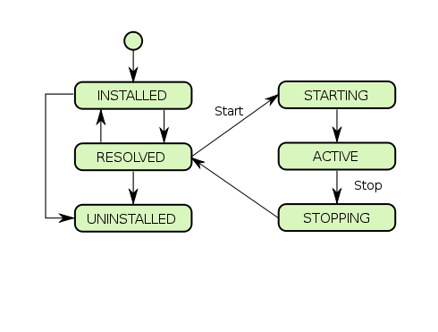

__Modern concurrency on the JVM__

A quick intro to futures, actors, STM, agents and something more

Miguel Ángel Pastor Olivar

`miguel.pastor@liferay.com`

[Personal Blog](http://migue.github.com)

---

Agenda
======

- Powers and perils of Concurrency
- Some strategies for concurrency
- Design approaches
- Modern topics
- Q & A

---

Benefits
==================

- Making apps more responsive
- Making apps faster
	- Services
	- Computation
	- Data

Problems
==========================

- Starvation and deadlocks
- Race conditions
---

Understanding the memory barrier
=================================
- Need to cross the barrier
- `synchronized` and `volatile` are the reserved keywords
- Changes are firstly, and localy, written in the caches and/or registers
- Then they are copied to the main memory
- Few operations cross the memory barrier:
	- `volatile`, `synchronized`, methods on `Thread`, `ExecutorService`, . . .

---

Kind of apps
============
- Number of Available Cores / (1 - Blocking Coefficient)
- IO intensive apps
	- Large blocking coefficient
	- More threads than the number of cores
	- Greater degree of concurrency
- Computationally intensive apps
	- Number of cores greater influence on the speedup
	- As many partitions (data) as the number of cores
	- More threads than cores does not help
	- More partitions better than fewer	
	- At some point, having more partitions has no benefit 

---

Strategies
==========
- 

---

Metadata example
================

- Lets go to see some real examples

---

OSGI lifecycle layer
====================

- Defines how bundles are installed and managed

---

Lifecycle management
====================

- Lets go to see some real examples

---

OSGI service layer
==================

- __SOA__ inside a __JVM__
- Publish, find and bind pattern
- Interface development approach
- CRC (Class Responsability Collaboration)

---

OSGI Service layer
==================

- Lets go to see some real examples

---

More . . .
===========

- __fragments__
- Component models
- Framework models
-

---

Delving deeper in Liferay
=========================

- A quick overview on Liferay's future
